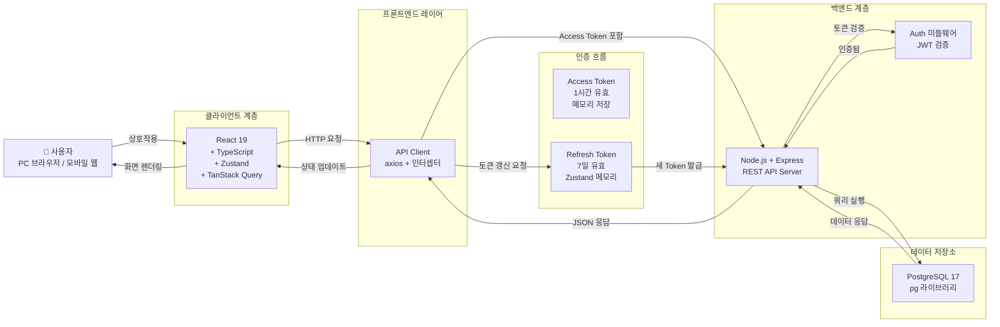
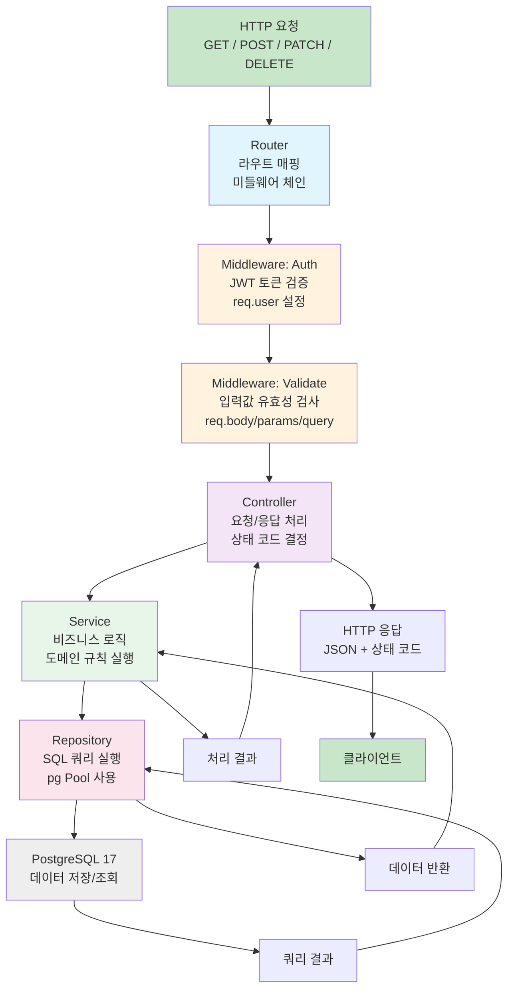
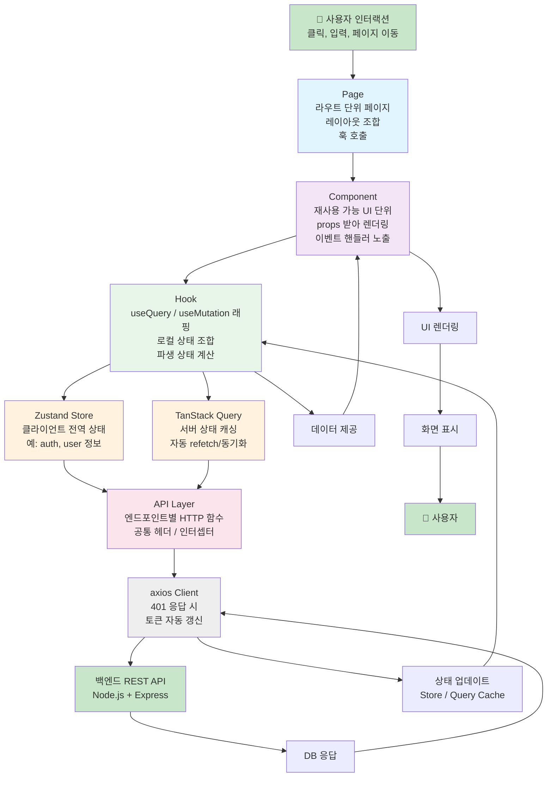
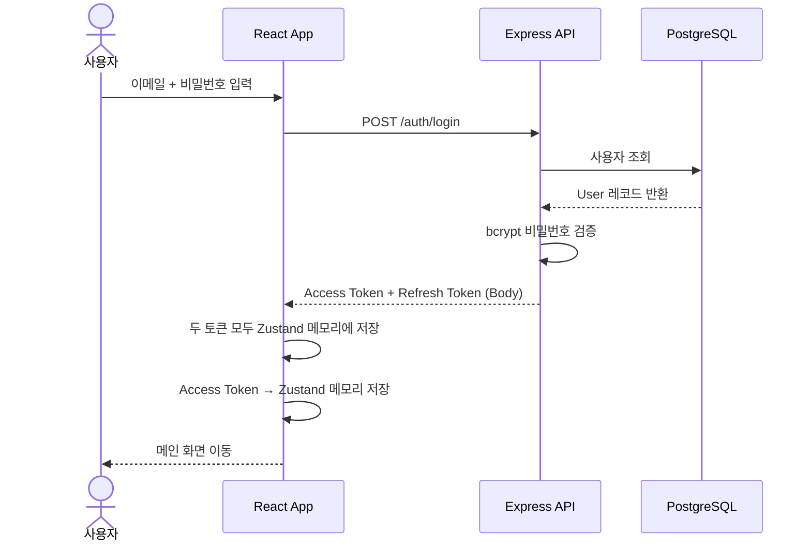
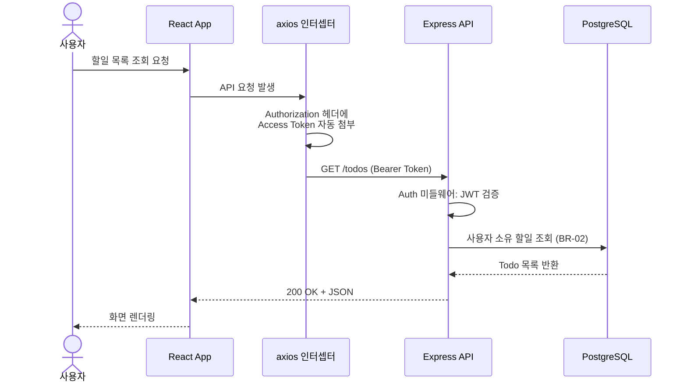
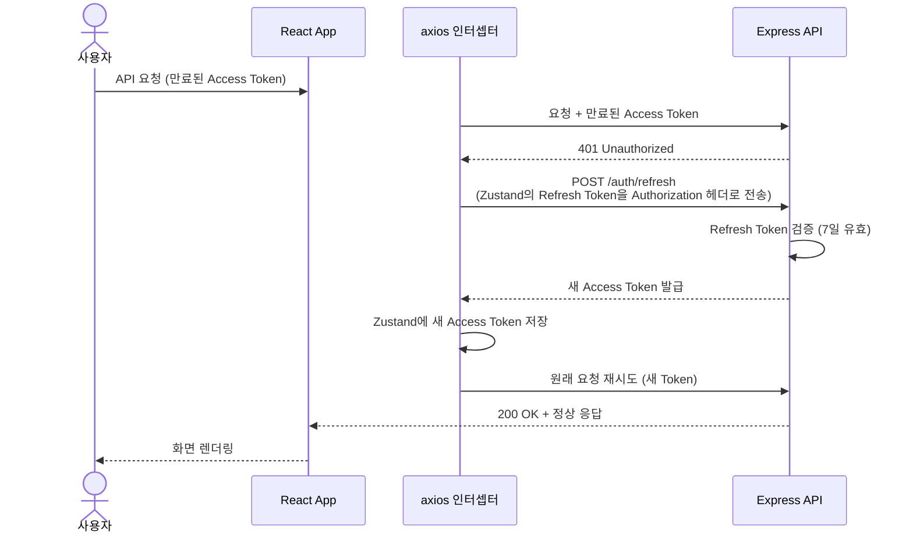
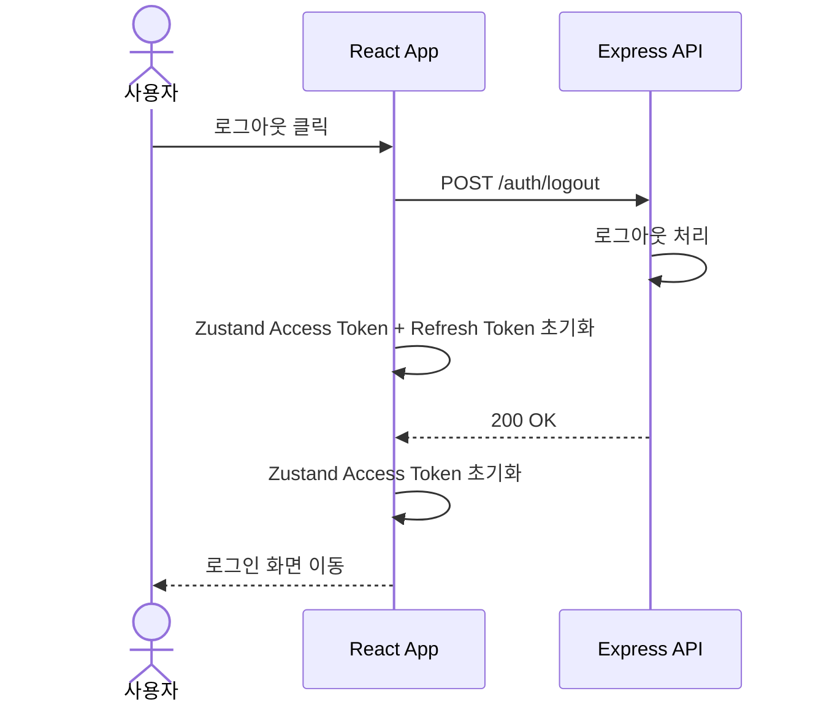

# 기술 아키텍처 다이어그램 - TodoListApp

**버전**: 1.1
**작성일**: 2026-05-13
**참조 문서**:
- [프로젝트 구조 설계 원칙 v1.0](./4-design-principles.md)
- [도메인 정의서 v1.0](./1-domain-definition.md)

---

## 목차

1. [전체 시스템 아키텍처](#1-전체-시스템-아키텍처)
2. [백엔드 레이어 구조](#2-백엔드-레이어-구조)
3. [프론트엔드 레이어 구조](#3-프론트엔드-레이어-구조)
4. [인증 흐름](#4-인증-흐름)

---

## 1. 전체 시스템 아키텍처

사용자 인터랙션부터 데이터 저장소까지의 전체 흐름을 표현합니다. JWT 토큰 인증(Access Token + Refresh Token)을 포함한 보안 아키텍처를 시각화합니다.

**주요 흐름**:
- **로그인**: 사용자 인증 후 Access Token + Refresh Token 모두 Zustand 메모리에 저장
- **API 요청**: 모든 요청에 Access Token 포함
- **토큰 만료**: 401 응답 시 자동으로 Refresh Token으로 새 Access Token 획득
- **데이터 저장**: PostgreSQL에 모든 사용자 데이터(User, Category, Todo) 저장

---

## 2. 백엔드 레이어 구조

HTTP 요청부터 데이터베이스까지의 처리 파이프라인입니다. 각 계층이 단일 책임을 지며 단방향 의존성을 유지합니다.

**레이어별 책임**:

| 계층 | 역할 | 예시 |
|------|------|------|
| **Router** | Express 라우팅, 미들웨어 체인 | `router.post('/todos', authenticate, validate, createTodo)` |
| **Middleware** | 인증/검증 | `authenticate`: JWT 검증, `validate`: 입력 스키마 검증 |
| **Controller** | HTTP 처리 | `createTodo(req, res)` → Service 호출 → 응답 반환 |
| **Service** | 비즈니스 규칙 | 소유권 검증, 트랜잭션 조율, 도메인 규칙 실행 |
| **Repository** | DB 접근 | SQL 쿼리 작성 및 실행, 결과 반환 |

**의존성 흐름**: Router → Middleware → Controller → Service → Repository → Database

---

## 3. 프론트엔드 레이어 구조

사용자 인터랙션부터 API 요청까지의 상태 관리 및 렌더링 파이프라인입니다. 관심사 분리를 통해 UI, 상태, 데이터 페칭을 명확히 분리합니다.

**레이어별 책임**:

| 계층 | 역할 | 예시 |
|------|------|------|
| **Page** | 페이지 단위 레이아웃 조합 | `TodoListPage`: 필터 + 목록 + 추가 폼 조합 |
| **Component** | UI 렌더링 및 이벤트 처리 | `TodoCard`: 할일 카드 표시 + 클릭 핸들러 |
| **Hook** | 데이터 페칭 및 상태 래핑 | `useTodos`: `useQuery` + 필터 파라미터 래핑 |
| **Store (Zustand)** | 클라이언트 전역 상태 | `useAuthStore`: 로그인 상태, Access Token |
| **Query (TanStack)** | 서버 상태 캐싱 | `useTodos` 결과: 서버 데이터 캐싱 및 자동 동기화 |
| **API Layer** | HTTP 함수 모음 | `todo.api.ts`: `getTodos()`, `createTodo()` 등 |

**상태 관리 원칙**:
- **Zustand**: 인증 정보(`accessToken`, `user`) 등 클라이언트 전역 상태만 관리
- **TanStack Query**: 서버에서 조회한 모든 데이터(todos, categories 등) 캐싱 및 동기화
- **로컬 상태**: Component 또는 Hook 내 `useState`로 폼 입력값 등 관리

**의존성 흐름**: Page → Component → Hook → (Store | Query) → API Layer → Backend

---

## 4. 인증 흐름

JWT Access Token + Refresh Token 기반의 인증 시나리오를 시퀀스 다이어그램으로 표현합니다.

### 4-1. 로그인 & 토큰 발급

### 4-2. 인증이 필요한 API 요청

### 4-3. Access Token 만료 & 자동 갱신

### 4-4. 로그아웃

---

## 아키텍처 설계 원칙

### 단방향 의존성 (Unidirectional Dependency)
- 상위 계층이 하위 계층을 의존하며, 역방향 의존은 금지
- 백엔드: Repository → Service → Controller (역방향 불가)
- 프론트엔드: Component → Hook → API Layer (역방향 불가)

### 관심사 분리 (Separation of Concerns)
- 각 계층은 하나의 책임만 담당
- Repository는 SQL만, Service는 비즈니스 로직만, Controller는 HTTP 처리만
- Component는 UI 렌더링만, Hook은 로직만, Store는 상태만

### 보안 아키텍처
- **Access Token**: 메모리 저장 (XSS 공격 방지)
- **Refresh Token**: Zustand 메모리 저장 (페이지 새로고침 시 소멸, 재로그인 필요)
- **자동 갱신**: axios 인터셉터가 401 응답을 가로채 토큰 자동 갱신
- **소유권 검증**: Service 계층에서 실행 (BR-02)

### 성능 최적화
- **TanStack Query**: 자동 캐싱, 중복 요청 제거, 백그라운드 동기화
- **Zustand**: 가벼운 상태 관리 라이브러리 (Redux 대비 번들 크기 15% 수준)
- **PostgreSQL**: 관계형 DB로 정규화된 스키마, 쿼리 최적화 가능

### 개발 경험 (DX)
- **TypeScript**: 타입 안전성으로 런타임 에러 감소
- **일관된 네이밍**: 파일명/함수명 컨벤션으로 코드 가독성 향상
- **에러 처리 통일**: 커스텀 `AppError` 클래스로 일관된 응답 형식

---
