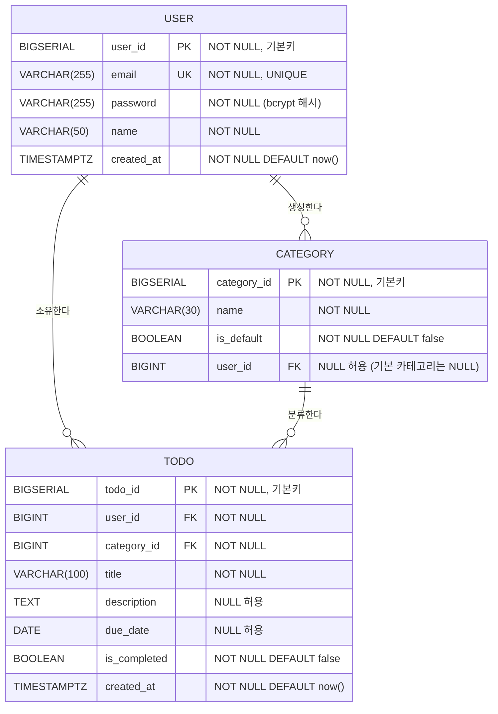

# ERD (Entity Relationship Diagram) - TodoListApp

**버전**: 1.0
**작성일**: 2026-05-13
**작성자**: Backend Developer
**참조 문서**:
- [도메인 정의서 v1.0](./1-domain-definition.md)
- [PRD v1.1](./2-prd.md)

---

## 변경 이력

| 버전 | 날짜 | 작성자 | 변경 내용 |
|------|------|--------|----------|
| 1.0 | 2026-05-13 | Backend Developer | 최초 작성 — 도메인 정의서 및 PRD 기반 ERD 작성 |

---

## 1. ERD 다이어그램

---

## 2. 테이블 정의 요약

### 2.1 USER 테이블

| 컬럼명 | 타입 | 제약조건 | 설명 |
|--------|------|----------|------|
| user_id | BIGSERIAL | PRIMARY KEY, NOT NULL | 사용자 고유 식별자 (자동 증가) |
| email | VARCHAR(255) | NOT NULL, UNIQUE | 이메일 주소. 로그인 ID로 사용. RFC 5322 형식, 중복 불가 |
| password | VARCHAR(255) | NOT NULL | bcrypt 해시 암호화된 비밀번호 (평문 저장 금지) |
| name | VARCHAR(50) | NOT NULL | 사용자 이름. 최소 1자, 최대 50자 |
| created_at | TIMESTAMPTZ | NOT NULL, DEFAULT now() | 계정 생성 일시 |

### 2.2 CATEGORY 테이블

| 컬럼명 | 타입 | 제약조건 | 설명 |
|--------|------|----------|------|
| category_id | BIGSERIAL | PRIMARY KEY, NOT NULL | 카테고리 고유 식별자 (자동 증가) |
| name | VARCHAR(30) | NOT NULL | 카테고리명. 최소 1자, 최대 30자. 동일 사용자 내 중복 불가 |
| is_default | BOOLEAN | NOT NULL, DEFAULT false | 기본 카테고리 여부. true이면 시스템 제공 카테고리 |
| user_id | BIGINT | FOREIGN KEY, NULL 허용 | 소유 사용자 ID. 기본 카테고리(is_default=true)는 NULL |

### 2.3 TODO 테이블

| 컬럼명 | 타입 | 제약조건 | 설명 |
|--------|------|----------|------|
| todo_id | BIGSERIAL | PRIMARY KEY, NOT NULL | 할일 고유 식별자 (자동 증가) |
| user_id | BIGINT | FOREIGN KEY, NOT NULL | 소유 사용자 ID. 반드시 인증된 사용자 참조 (BR-02) |
| category_id | BIGINT | FOREIGN KEY, NOT NULL | 분류 카테고리 ID. 할일 등록 시 필수 지정 (BR-03) |
| title | VARCHAR(100) | NOT NULL | 할일 제목. 최소 1자, 최대 100자 |
| description | TEXT | NULL 허용 | 할일 설명. 선택 입력, 최대 1,000자 |
| due_date | DATE | NULL 허용 | 종료예정일. 선택 입력, 등록 시 오늘 이후 날짜만 허용 |
| is_completed | BOOLEAN | NOT NULL, DEFAULT false | 완료 여부. false=미완료, true=완료 |
| created_at | TIMESTAMPTZ | NOT NULL, DEFAULT now() | 할일 등록 일시. 목록 조회 기본 정렬 기준 (내림차순) |

---

## 3. 관계 및 제약조건 설명

### 3.1 외래 키(FK) 관계 및 ON DELETE 정책

| FK 관계 | 참조 방향 | ON DELETE 정책 | 근거 |
|---------|----------|----------------|------|
| TODO.user_id → USER.user_id | TODO → USER | CASCADE | UC-14: 회원 탈퇴 시 해당 사용자의 모든 할일 즉시 삭제 |
| CATEGORY.user_id → USER.user_id | CATEGORY → USER | CASCADE | UC-14: 회원 탈퇴 시 사용자 정의 카테고리 즉시 삭제 |
| TODO.category_id → CATEGORY.category_id | TODO → CATEGORY | SET DEFAULT | UC-07: 카테고리 삭제 시 소속 할일은 기본 카테고리 "일반"으로 자동 이동 |

> SET DEFAULT 적용 시 TODO.category_id의 DEFAULT 값은 기본 카테고리 "일반"의 category_id로 설정해야 한다.

### 3.2 기본 카테고리(is_default = true) 특수 처리

| 규칙 | 내용 |
|------|------|
| 소유자 없음 | 기본 카테고리는 시스템 소유이므로 CATEGORY.user_id = NULL |
| 수정·삭제 불가 | BR-04: 기본 카테고리는 사용자가 수정하거나 삭제할 수 없다. API 레벨에서 is_default=true인 카테고리에 대한 수정·삭제 요청을 거부한다 |
| 카테고리 삭제 시 이동 대상 | 사용자 정의 카테고리 삭제 시 해당 카테고리에 속한 할일은 기본 카테고리 "일반"(is_default=true)으로 자동 이동된다 |
| 시드 데이터 필요 | 시스템 초기화 시 기본 카테고리 (일반, 업무, 개인 등)를 시드 데이터로 삽입해야 한다 |

### 3.3 데이터 격리 및 소유권 검증

| 규칙 | 내용 |
|------|------|
| BR-02 | TODO.user_id는 항상 현재 인증된 사용자의 user_id여야 한다. NOT NULL 제약 및 API 레벨 소유권 검증 필수 |
| BR-03 | TODO.category_id는 NOT NULL. 할일 등록 시 반드시 본인 소유 카테고리 또는 기본 카테고리 중 하나를 지정해야 한다 |
| BR-05 | CATEGORY.user_id를 통해 사용자 정의 카테고리의 소유자를 식별하며, 본인 소유 카테고리만 수정·삭제 가능 |
| BR-07 | 사용자는 자신의 USER 레코드(이름, 비밀번호)만 수정 가능. 비밀번호 변경 시 현재 비밀번호 재확인 필요 |

### 3.4 인덱스 전략

| 테이블 | 인덱스 대상 컬럼 | 목적 |
|--------|----------------|------|
| USER | email | UNIQUE 제약 + 로그인 조회 성능 |
| CATEGORY | user_id | 사용자별 카테고리 목록 조회 성능 |
| TODO | user_id | 사용자별 할일 목록 조회 성능 |
| TODO | category_id | 카테고리별 필터링 성능 |
| TODO | (user_id, is_completed) | 완료 여부 필터링 복합 인덱스 |
| TODO | created_at | 기본 정렬(등록일시 내림차순) 성능 |
