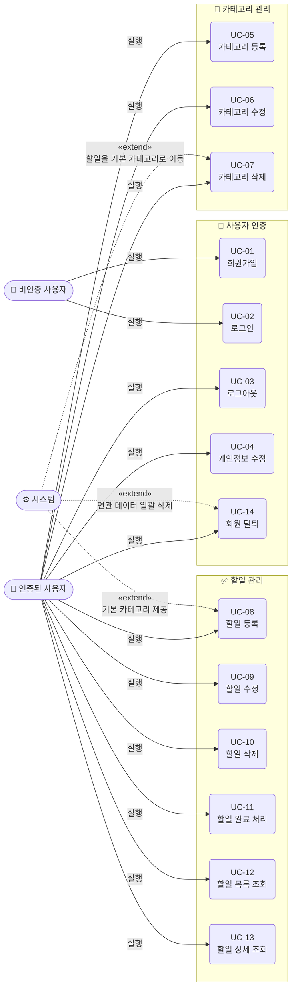
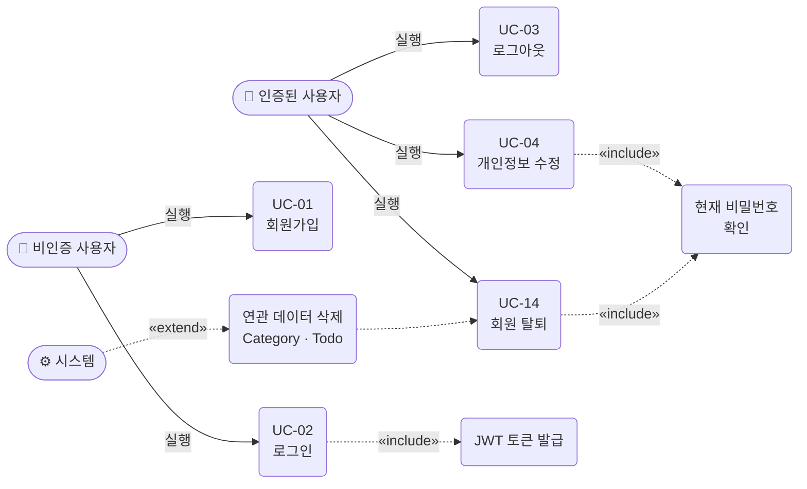
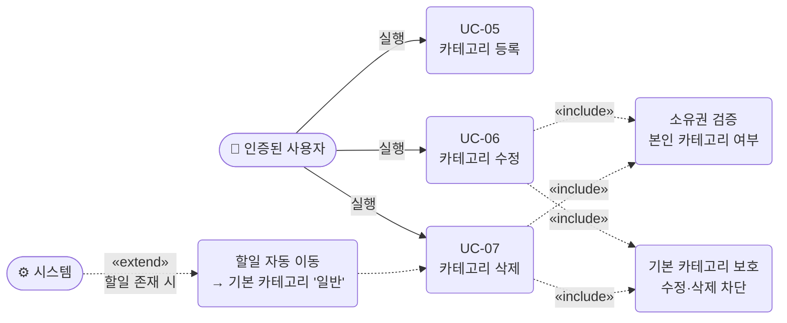
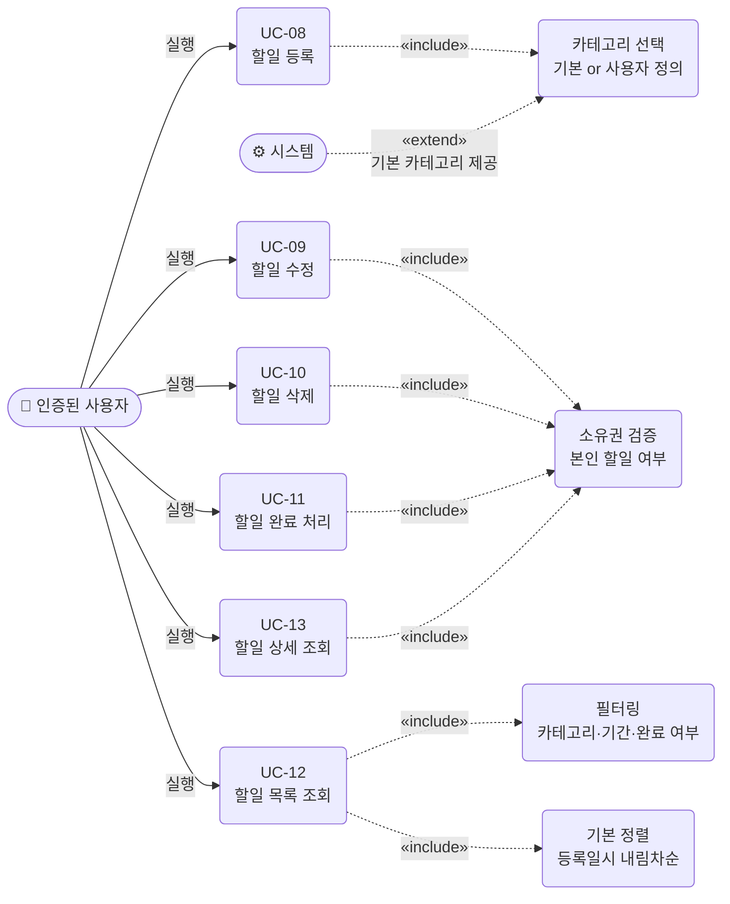

# 유스케이스 다이어그램 - TodoListApp

**버전**: 1.0  
**작성일**: 2026-05-13  
**참조 문서**: [PRD v1.1](./2-prd.md)

---

## 전체 유스케이스 다이어그램

---

## 도메인 영역별 상세 다이어그램

### 1. 사용자 인증

### 2. 카테고리 관리

### 3. 할일 관리

---

## 유스케이스 목록 요약

| UC-ID | 유스케이스 | 액터 | 관련 BR |
|-------|-----------|------|--------|
| UC-01 | 회원가입 | 비인증 사용자 | BR-01 |
| UC-02 | 로그인 | 비인증 사용자 | BR-01 |
| UC-03 | 로그아웃 | 인증된 사용자 | BR-01 |
| UC-04 | 개인정보 수정 | 인증된 사용자 | BR-07 |
| UC-05 | 카테고리 등록 | 인증된 사용자 | BR-05 |
| UC-06 | 카테고리 수정 | 인증된 사용자 | BR-04, BR-05 |
| UC-07 | 카테고리 삭제 | 인증된 사용자 | BR-04, BR-05 |
| UC-08 | 할일 등록 | 인증된 사용자 | BR-02, BR-03 |
| UC-09 | 할일 수정 | 인증된 사용자 | BR-02 |
| UC-10 | 할일 삭제 | 인증된 사용자 | BR-02 |
| UC-11 | 할일 완료 처리 | 인증된 사용자 | BR-02 |
| UC-12 | 할일 목록 조회 | 인증된 사용자 | BR-02, BR-06 |
| UC-13 | 할일 상세 조회 | 인증된 사용자 | BR-02 |
| UC-14 | 회원 탈퇴 | 인증된 사용자 | BR-07 |
